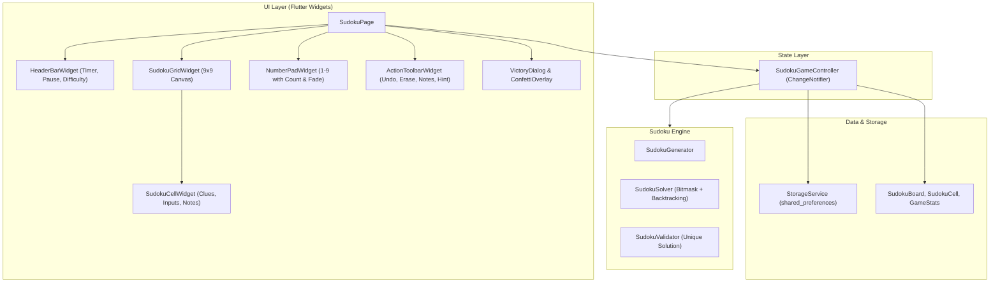

# Modern Sudoku Game Design Document & Technical Specification

## 1. Project Overview & Philosophy

The objective is to create a modern, elegant, and 100% free Sudoku game built with Flutter.
- **Zero Ads & Zero Distractions**: No banners, interstitial ads, paywalls, or forced tracking.
- **Modern Quality-of-Life**: Incorporating best-in-class features from top contemporary digital Sudoku implementations (e.g., *Good Sudoku*, *Sudoku.com*).
- **Tactile, Responsive Feel**: Instant feedback with subtle animations, crosshair highlighting, completion flashes, and haptic ticks.
- **Cross-Platform Readiness**: Designed for mobile (iOS, Android), desktop (macOS, Windows, Linux), and web.

---

## 2. Core Feature Analysis & Design Decisions

### 2.1. Disappearing Completed Numbers (Keypad 1–9)
- **Concept**: Once all 9 instances of a digit (e.g., all 9 '5's) are correctly placed on the board, that digit disappears from the number selection pad.
- **UX Recommendation (Fixed Position Fade)**:
  - Dynamic re-flow (where remaining buttons expand or shift to fill space) disrupts finger muscle memory (e.g., button 7 jumping into button 5's position).
  - Instead, the 9 slots remain in fixed positions (1 on the left, 9 on the right). When a digit reaches 9 correct placements, its button smoothly **fades out / hides** or displays an unobtrusive completed checkmark (`✓`).
  - Below each number button, a small count badge shows how many instances remain (e.g. `2` remaining), which transitions to `0` and fades when finished.

### 2.2. Same-Number & Crosshair Highlighting
- **Concept**: Selecting any cell containing a number immediately highlights all matching numbers across the 9×9 grid.
- **Highlight Layers**:
  1. **Active Cell**: Bold focal highlight with distinct border and accent background.
  2. **Matching Numbers**: Bright accent tint across all cells containing the same digit.
  3. **Row, Column, and 3×3 Box Crosshair**: Gentle translucent neutral tint extending through the active cell’s row, column, and 3×3 box to aid rapid horizontal, vertical, and block scanning.
  4. **Pencil Notes Highlight**: Empty cells that contain matching pencil marks of the selected digit will subtly highlight that tiny candidate number.

### 2.3. Row, Column, and 3×3 Box Completion Celebrations
- **Concept**: When a player completes a row, column, or 3×3 block with valid numbers 1–9, the completed section is visually celebrated.
- **Visual Effect**: A quick, satisfying sweep/glow flash across the completed 9-cell region, paired with a soft haptic vibration.

### 2.4. Erase System
- **Concept**: Erase answers entered by the player.
- **Rules**:
  - Clue (given) numbers are immutable and can never be erased or overwritten.
  - Erase button clears player-placed numbers.
  - If a cell has pencil marks (notes), erase clears the notes.
  - Tapping an existing player-placed number with the same digit selected also clears/toggles it.

### 2.5. Timer & Smart Pause
- **Concept**: Track elapsed time for the current puzzle.
- **Features**:
  - Prominent elapsed time counter (`MM:SS`).
  - **Pause Button**: Pausing the game blurs/obscures the grid to prevent players from studying the puzzle while the clock is stopped.
  - Automatic pause on app backgrounding/minimization.
  - Tracks and stores personal best time per difficulty.

### 2.6. Difficulty Tiers & Unique Solution Guarantee
- **Concept**: Choose between Easy, Medium, and Hard (with optional Expert tier).
- **Calibrated Difficulty Matrix**:
  | Difficulty | Given Clues | Required Techniques | Average Solve Time |
  | :--- | :---: | :--- | :---: |
  | **Easy** | 36 – 40 | Naked Singles, direct cross-hatching | 3 – 6 min |
  | **Medium** | 30 – 34 | Hidden Singles, Naked Pairs | 6 – 12 min |
  | **Hard** | 25 – 29 | Pointing Pairs, Box-Line Reduction, Triples | 12 – 25 min |
  | **Expert** | 22 – 24 | X-Wing, Swordfish, advanced chaining | 20+ min |
- **Strict Requirement**: Every generated puzzle is mathematically validated to have **exactly one unique solution**.

### 2.7. Hint System
- **Concept**: Assist the player when stuck.
- **Implementation**:
  - **Direct Hint**: Automatically fills the selected empty cell with the correct answer from the solution matrix and briefly pulses green.
  - **Smart / Educational Hint (Optional Extension)**: Identifies the next logically deducible cell and visually explains why (e.g., "This cell is the only remaining place for digit 4 in this 3×3 box").

---

## 3. Additional Modern Sudoku Features

1. **Pencil Notes Mode (Candidate Marking)**:
   - Quick toggle for pencil/notes mode.
   - Cells display a 3×3 mini grid of small numbers (1–9).
   - **Auto-Erase Notes**: When a final number is placed, any matching pencil notes in that cell’s row, column, and 3×3 box are automatically eliminated, removing tedious manual bookkeeping.
2. **Infinite Undo & Redo**:
   - Maintains a command history stack. Every action (number placement, note addition, erase) can be reverted or redone without penalty.
3. **Dual Input Modes**:
   - **Cell-First**: Tap a cell, then tap a number.
   - **Digit-First (Fast Placement)**: Select a digit (e.g. 7), then tap empty cells across the board to place 7s rapidly.
4. **Duplicate / Conflict Detection**:
   - Immediate subtle visual indicators (red text/background) if a digit violates Sudoku rules by appearing twice in the same row, column, or 3×3 box.
   - Choice between **Casual / Zen Mode** (unlimited errors) or **Challenge Mode** (3 mistakes limit).
5. **Auto-Save & Instant Resume**:
   - Saves active board state, pencil marks, elapsed time, and difficulty on any change.
   - Resumes seamlessly when the app is reopened.
6. **Victory Celebration & Statistics**:
   - Confetti particle explosion upon completing the board.
   - Summary showing completion time, personal best comparison, and total games won / win rate.
7. **Clean Themes**:
   - Minimalist Material 3 light and dark themes, optimized for high contrast and readability.

---

## 4. Technical Architecture



### 4.1. Key Directory Structure
```
sudoku/
├── docs/
│   └── sudoku_design_document.md
└── sudoku/
    ├── lib/
    │   ├── main.dart
    │   ├── models/
    │   │   ├── sudoku_cell.dart
    │   │   ├── sudoku_board.dart
    │   │   ├── game_action.dart
    │   │   ├── game_stats.dart
    │   │   └── game_enums.dart
    │   ├── engine/
    │   │   ├── sudoku_solver.dart
    │   │   ├── sudoku_generator.dart
    │   │   └── puzzle_seeds.dart
    │   ├── controllers/
    │   │   └── sudoku_controller.dart
    │   ├── services/
    │   │   └── storage_service.dart
    │   └── ui/
    │       ├── pages/
    │       │   └── sudoku_page.dart
    │       ├── widgets/
    │       │   ├── sudoku_grid_widget.dart
    │       │   ├── sudoku_cell_widget.dart
    │       │   ├── number_pad_widget.dart
    │       │   ├── action_toolbar_widget.dart
    │       │   ├── header_bar_widget.dart
    │       │   ├── difficulty_dialog.dart
    │       │   └── victory_dialog.dart
    │       └── theme/
    │           └── sudoku_theme.dart
    └── test/
        ├── engine_test.dart
        ├── controller_test.dart
        └── widget_test.dart
```

---

## 5. Sudoku Engine Algorithms

### 5.1. Solver & Constraint Propagation
The solver utilizes bitmasks (represented as 9-bit integers $1 \ll (\text{digit}-1)$) to track available candidates per row, column, and $3\times3$ box.
- Candidate bitmask for cell $(r, c, b)$:
  $$\text{candidates} = \sim(\text{rowMask}[r] \mid \text{colMask}[c] \mid \text{boxMask}[b]) \ \& \ 0\text{x}1\text{FF}$$
- Search uses the **Minimum Remaining Values (MRV)** heuristic: always branches on the cell with the fewest valid candidates first.
- Supports finding a single solution or counting total solutions up to 2 (to verify uniqueness).

### 5.2. Generator & Symmetry
1. **Initial Solved Grid Generation**: Randomly fills an empty 9×9 grid using randomized backtracking solver.
2. **Clue Digging**: Removes pairs of numbers symmetrically (180° rotational symmetry) while testing with `countSolutions(board) == 1`.
3. **Difficulty Grading**: Continues digging until clue count hits the target for the selected difficulty level.
4. **Seed Bank**: Pre-computed curated puzzle seeds are also embedded for immediate instant-load on first launch.

---

## 6. Verification & Quality Assurance

- **Unit Tests**:
  - Solver correctly solves standard test puzzles.
  - Generator produces puzzles with exactly 1 unique solution.
  - Controller correctly tracks remaining counts and detects completed digits.
  - Controller triggers completion events for completed rows, columns, and boxes.
  - Pencil notes auto-clear on placement.
  - Undo/redo reverts actions accurately.
- **Performance**:
  - Puzzle generation runs asynchronously in background to ensure 60/120 FPS UI smoothness.
- **Cross-Platform Verification**:
  - Validated on macOS desktop and responsive across mobile/web screen ratios.
